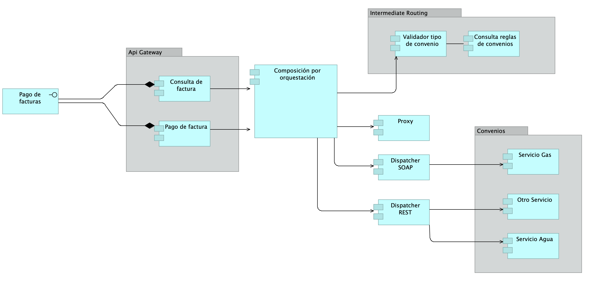

# Arquitectura Candidata



## Arquitectura Definitiva

La solución para la implementación de los convenios de pago del banco ABC se modeló de la siguiente manera:


La arquitectura se basa en un patron SOA, basado en microservicios.

Los microservicios son:

1. Eureka server que hace de descubridor de servicios.
2. Un microservicio gateway que tiene las funciones del negocio y se comunica con los microservicios haciendo las veces del intermediador de las rutas.
3. Un microservicio por convenio, que hace las veces de api proxy, este recibe los parámetros dados por el gateway y se comunica con los servicios del proveedor del convenio correpondiente.


## Trade Offs

| Nombre | Descripción |
 -- | -- |
| Escalabilidad | Bajo costo para agregar capacidad si la carga aumenta. | 
| Composabilidad | Escribir un nuevo convenio permite reusar bastante código a través de la implementación de las interfaces propuestas. |
| Modularidad | Cada servicio de composición es un módulo que se despliega independientemente. |
| Performance | Alto rendimiento en el descubrimiento y presentación de servicios. "


# Servicio de Pagos

Microservicio base para el Taller 2 de Modelado y Validación.

Este proyecto está dividido en submodulos de Gradle, cada submodulo es un microservicio.

Al enviar cambios a este repositorio, automaticamente se empaqueta y se crea la imagen correspondiente de docker en:

https://github.com/pujaesprojects/modval-servicio-pagos/packages


### Ejecución:

Es requisito que para la ejecución de cualquier microservicio se debe levantar el servidor eureka definido en:

https://github.com/pujaesprojects/modval-eureka-server

Para ejecutar cualquiera de los microservicios se debe ejecutar:

```bash
./gradlew [submodulo]:bootRun
```

Ej:

```bash
./gradlew modval-gateway:bootRun
```

#### Gateway:

```bash
./gradlew modval-gateway:bootRun
```

#### Microservicio de Agua:

```bash
./gradlew modval-water:bootRun
```

#### Microservicio de Gas:

```bash
./gradlew modval-gas:bootRun
```

### Creación de jar ejecutable:

Para crear el jar ejecutable se debe ejecutar:

```bash
./gradlew [submodulo]:bootJar
```

### Despliegue:

Para el despliegue se utilizan las imagenes de docker que se encuentran en: https://github.com/pujaesprojects/modval-servicio-pagos/packages

#### Creación de red docker (primera vez)

```bash
docker network create modval
```


#### Ejecución de los microservicios:

```bash

docker run --name "eureka-server" -p 8761:8761 -d -t docker.pkg.github.com/pujaesprojects/modval-eureka-server/registry

docker run --name "modval-gateway" -p 8080:8090 --network modval -e "EUREKA_URI=http://eureka-server:8761/eureka" -d -t docker.pkg.github.com/pujaesprojects/modval-servicio-pagos/modval-gateway

docker run --name "modval-water" --network modval -e "WATER_URI=http://water-service:8080/servicios/pagos/v1" -e "EUREKA_URI=http://eureka-server:8761/eureka" -d -t docker.pkg.github.com/pujaesprojects/modval-servicio-pagos/modval-water

docker run --name "modval-gas" --network modval -e "GAS_URI=http://gas-service-soap_web-services_1:8080/gas-service/PagosService" -e "EUREKA_URI=http://eureka-server:8761/eureka" -d -t docker.pkg.github.com/pujaesprojects/modval-servicio-pagos/modval-gas

```

### Documentación de Referencia
Esta documentación puede ser util para futuras referencias:

* [Official Gradle documentation](https://docs.gradle.org)
* [Spring Boot Gradle Plugin Reference Guide](https://docs.spring.io/spring-boot/docs/2.2.5.RELEASE/gradle-plugin/reference/html/)
* [Spring Cloud OpenFeign](https://cloud.spring.io/spring-cloud-openfeign/reference/html/)
* [Introduction to Spring Cloud OpenFeign](https://www.baeldung.com/spring-cloud-openfeign)


### Referencia adicional
These additional references should also help you:

* [Gradle Build Scans – insights for your project's build](https://scans.gradle.com#gradle)
