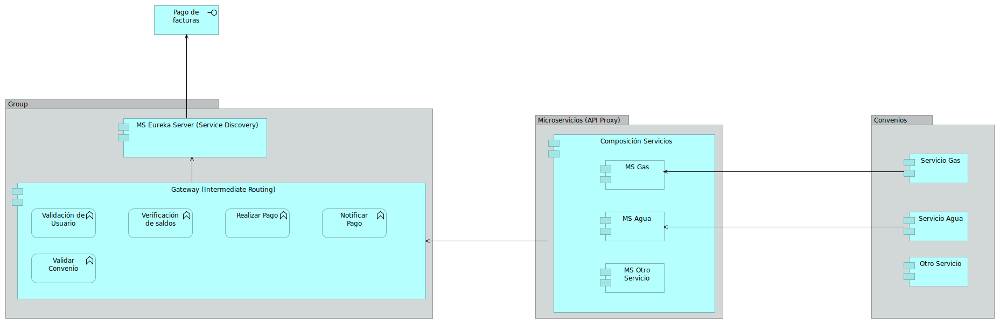

# Arquitectura Candidata

https://github.com/pujaesprojects/modval-servicio-pagos/resources/doc/images/arquitectura_candidata.png

# Servicio de Pagos

Microservicio base para el Taller 2 de Modelado y Validación.

Este proyecto está dividido en submodulos de Gradle, cada submodulo es un microservicio.

Al enviar cambios a este repositorio, automaticamente se empaqueta y se crea la imagen correspondiente de docker en:

https://github.com/pujaesprojects/modval-servicio-pagos/packages

## Modelo

La solución para la implementación de los convenios de pago del banco ABC se modeló de la siguiente manera:




### Ejecución:

Es requisito que para la ejecución de cualquier microservicio se debe levantar el servidor eureka definido en:

https://github.com/pujaesprojects/modval-eureka-server

Para ejecutar cualquiera de los microservicios se debe ejecutar:

```bash
./gradlew [submodulo]:bootRun
```

Ej:

```bash
./gradlew modval-gateway:bootRun
```

#### Gateway:

```bash
./gradlew modval-gateway:bootRun
```

#### Microservicio de Agua:

```bash
./gradlew modval-water:bootRun
```

#### Microservicio de Gas:

```bash
./gradlew modval-gas:bootRun
```

### Creación de jar ejecutable:

Para crear el jar ejecutable se debe ejecutar:

```bash
./gradlew [submodulo]:bootJar
```
